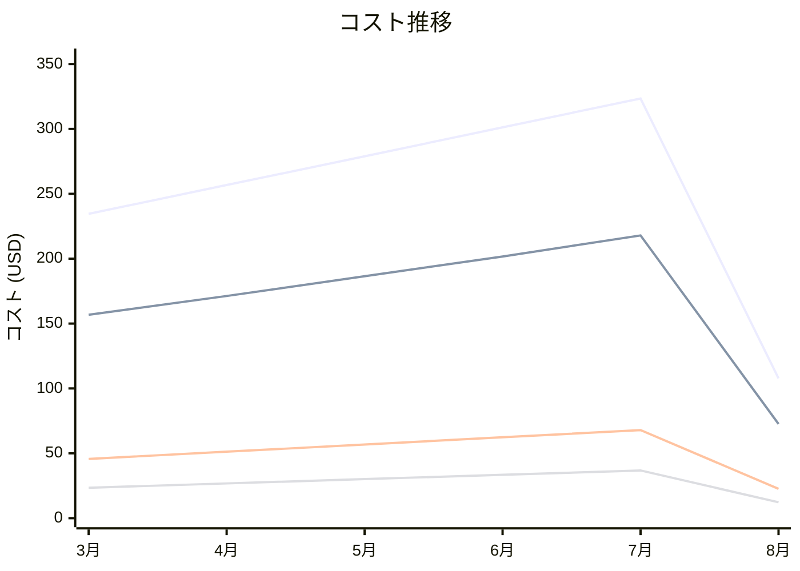

# Alert Logic Managed Rules for WAF OWASP Top 10 for WordPress コスト分析レポート

**分析日**: 2025/08/14

## 概要

Alert Logic Managed Rules for WAF OWASP Top 10 for WordPressの2025年3月から8月までの6ヶ月間のコスト分析結果です。

## 料金の特徴

### 分析サマリー
- コスト削減トレンド（10%以上の削減）
- 変動性が高い

### 費用項目詳細

| 費用項目 | 説明 | 6ヶ月平均 | 成長率 | 変動幅 |
|---------|------|----------|--------|--------|
| All | 全体費用 | $250.46 | -54.0% | $215.63 |
| Rule Management | Alert Logic OWASP Top 10ルール管理料金 | $167.78 | -53.7% | $145.26 |
| Threat Intelligence | Alert Logic脅威インテリジェンス料金 | $51.09 | -50.4% | $45.26 |
| Custom Rules | Alert Logicカスタムルール料金 | $27.14 | -47.7% | $24.52 |
| Monitoring | Alert Logicモニタリング料金 | $4.45 | -96.5% | $8.36 |

## コスト最適化提案

### 主要な推奨事項

### 月次コスト詳細

| 費用項目 | 2025年3月 | 2025年4月 | 2025年5月 | 2025年6月 | 2025年7月 | 2025年8月 |
|---------|---------|---------|---------|---------|---------|---------|
| All | $234.56 | $256.78 | $278.90 | $301.23 | $323.45 | $107.82 |
| Rule Management | $156.78 | $171.23 | $186.45 | $201.67 | $217.89 | $72.63 |
| Threat Intelligence | $45.67 | $51.23 | $56.78 | $62.34 | $67.89 | $22.63 |
| Custom Rules | $23.45 | $26.78 | $30.12 | $33.45 | $36.78 | $12.26 |
| Monitoring | $8.66 | $7.54 | $5.55 | $3.77 | $0.89 | $0.30 |

### コスト推移グラフ

**凡例:**
- ● **All** (平均: $250.46)
- ● **Rule Management** (平均: $167.78)
- ● **Threat Intelligence** (平均: $51.09)
- ● **Custom Rules** (平均: $27.14)

---
*このレポートは自動生成されました。最新の分析結果については定期的に更新してください。*
