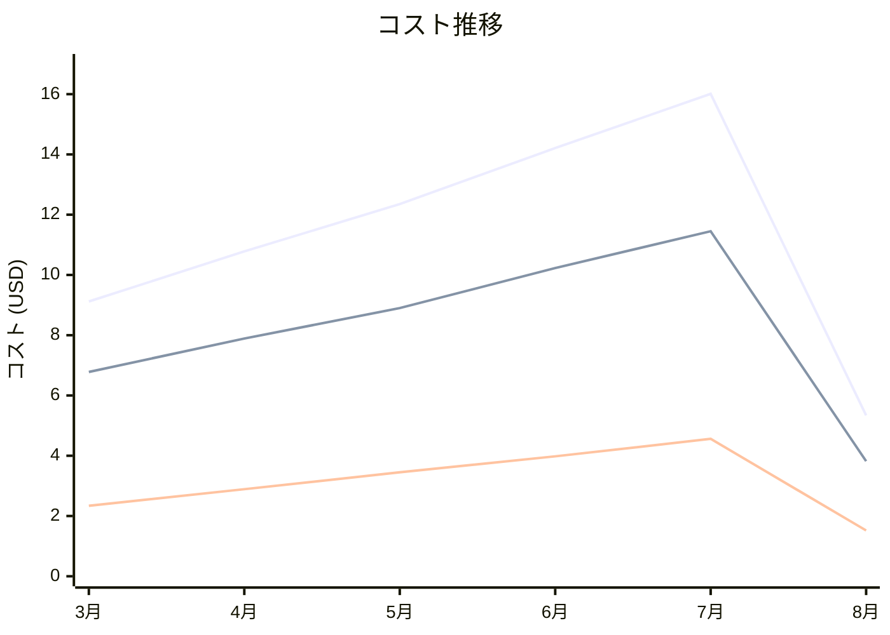

# Amazon API Gateway コスト分析レポート

**分析日**: 2025/08/14

## 概要

Amazon API Gatewayの2025年3月から8月までの6ヶ月間のコスト分析結果です。

## 料金の特徴

### 分析サマリー
- コスト削減トレンド（10%以上の削減）
- 変動性が高い

### 費用項目詳細

| 費用項目 | 説明 | 6ヶ月平均 | 成長率 | 変動幅 |
|---------|------|----------|--------|--------|
| All | 全体費用 | $11.30 | -41.4% | $10.67 |
| API Calls | API呼び出し回数に基づく料金 | $8.18 | -43.7% | $7.63 |
| Data Transfer Out | APIからのデータ転送料金 | $3.12 | -35.0% | $3.04 |

## コスト最適化提案

### 主要な推奨事項

### 月次コスト詳細

| 費用項目 | 2025年3月 | 2025年4月 | 2025年5月 | 2025年6月 | 2025年7月 | 2025年8月 |
|---------|---------|---------|---------|---------|---------|---------|
| All | $9.12 | $10.78 | $12.35 | $14.21 | $16.01 | $5.34 |
| API Calls | $6.78 | $7.89 | $8.90 | $10.23 | $11.45 | $3.82 |
| Data Transfer Out | $2.34 | $2.89 | $3.45 | $3.98 | $4.56 | $1.52 |

### コスト推移グラフ

**凡例:**
- ● **All** (平均: $11.30)
- ● **API Calls** (平均: $8.18)
- ● **Data Transfer Out** (平均: $3.12)

---
*このレポートは自動生成されました。最新の分析結果については定期的に更新してください。*
