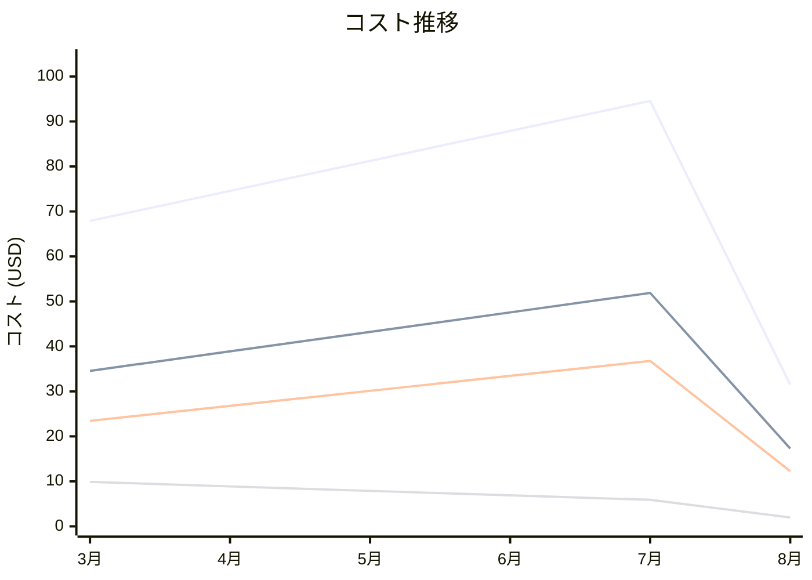

# AWS End User Messaging コスト分析レポート

**分析日**: 2025/08/14

## 概要

AWS End User Messagingの2025年3月から8月までの6ヶ月間のコスト分析結果です。

## 料金の特徴

### 分析サマリー
- コスト削減トレンド（10%以上の削減）
- 変動性が高い

### 費用項目詳細

| 費用項目 | 説明 | 6ヶ月平均 | 成長率 | 変動幅 |
|---------|------|----------|--------|--------|
| All | 全体費用 | $72.94 | -53.6% | $63.04 |
| SMS Messages | SMSメッセージ送信料金 | $38.91 | -49.9% | $34.59 |
| Voice Messages | 音声メッセージ送信料金 | $27.14 | -47.7% | $24.52 |
| Email Messages | Eメールメッセージ送信料金 | $6.90 | -80.2% | $7.92 |

## コスト最適化提案

### 主要な推奨事項

### 月次コスト詳細

| 費用項目 | 2025年3月 | 2025年4月 | 2025年5月 | 2025年6月 | 2025年7月 | 2025年8月 |
|---------|---------|---------|---------|---------|---------|---------|
| All | $67.89 | $74.56 | $81.23 | $87.90 | $94.56 | $31.52 |
| SMS Messages | $34.56 | $38.90 | $43.23 | $47.56 | $51.89 | $17.30 |
| Voice Messages | $23.45 | $26.78 | $30.12 | $33.45 | $36.78 | $12.26 |
| Email Messages | $9.88 | $8.88 | $7.88 | $6.89 | $5.89 | $1.96 |

### コスト推移グラフ

**凡例:**
- ● **All** (平均: $72.94)
- ● **SMS Messages** (平均: $38.91)
- ● **Voice Messages** (平均: $27.14)
- ● **Email Messages** (平均: $6.90)

---
*このレポートは自動生成されました。最新の分析結果については定期的に更新してください。*
