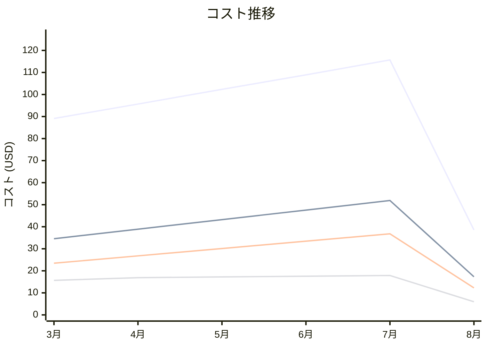

# AWS Secrets Manager コスト分析レポート

**分析日**: 2025/08/14

## 概要

AWS Secrets Managerの2025年3月から8月までの6ヶ月間のコスト分析結果です。

## 料金の特徴

### 分析サマリー
- コスト削減トレンド（10%以上の削減）
- 変動性が高い

### 費用項目詳細

| 費用項目 | 説明 | 6ヶ月平均 | 成長率 | 変動幅 |
|---------|------|----------|--------|--------|
| All | 全体費用 | $91.71 | -56.7% | $77.11 |
| Secret Storage | シークレットストレージ月額料金 | $38.91 | -49.9% | $34.59 |
| API Requests | シークレット取得APIリクエスト料金 | $27.14 | -47.7% | $24.52 |
| Rotation | シークレット自動ローテーション料金 | $15.20 | -62.0% | $11.93 |
| Cross-Region Replication | シークレットクロスリージョンレプリケーション料金 | $10.30 | -80.3% | $12.40 |

## コスト最適化提案

### 主要な推奨事項

### 月次コスト詳細

| 費用項目 | 2025年3月 | 2025年4月 | 2025年5月 | 2025年6月 | 2025年7月 | 2025年8月 |
|---------|---------|---------|---------|---------|---------|---------|
| All | $89.12 | $95.67 | $102.34 | $108.90 | $115.67 | $38.56 |
| Secret Storage | $34.56 | $38.90 | $43.23 | $47.56 | $51.89 | $17.30 |
| API Requests | $23.45 | $26.78 | $30.12 | $33.45 | $36.78 | $12.26 |
| Rotation | $15.67 | $16.89 | $17.23 | $17.56 | $17.89 | $5.96 |
| Cross-Region Replication | $15.44 | $13.10 | $11.76 | $9.33 | $9.11 | $3.04 |

### コスト推移グラフ

**凡例:**
- ● **All** (平均: $91.71)
- ● **Secret Storage** (平均: $38.91)
- ● **API Requests** (平均: $27.14)
- ● **Rotation** (平均: $15.20)

---
*このレポートは自動生成されました。最新の分析結果については定期的に更新してください。*
