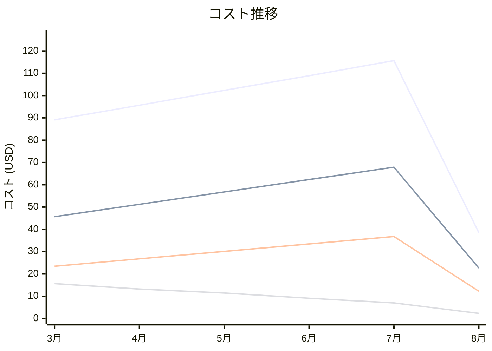

# AWS Step Functions コスト分析レポート

**分析日**: 2025/08/14

## 概要

AWS Step Functionsの2025年3月から8月までの6ヶ月間のコスト分析結果です。

## 料金の特徴

### 分析サマリー
- コスト削減トレンド（10%以上の削減）
- 変動性が高い

### 費用項目詳細

| 費用項目 | 説明 | 6ヶ月平均 | 成長率 | 変動幅 |
|---------|------|----------|--------|--------|
| All | 全体費用 | $91.71 | -56.7% | $77.11 |
| State Transitions | Step Functions状態遷移料金 | $51.09 | -50.4% | $45.26 |
| Express Workflows | Step Functionsエクスプレスワークフロー料金 | $27.14 | -47.7% | $24.52 |
| Standard Workflows | Step Functions標準ワークフロー料金 | $9.79 | -85.1% | $13.34 |
| Map State Iterations | Step Functions Mapステート反復料金 | $3.69 | -69.1% | $3.10 |

## コスト最適化提案

### 主要な推奨事項

### 月次コスト詳細

| 費用項目 | 2025年3月 | 2025年4月 | 2025年5月 | 2025年6月 | 2025年7月 | 2025年8月 |
|---------|---------|---------|---------|---------|---------|---------|
| All | $89.12 | $95.67 | $102.34 | $108.90 | $115.67 | $38.56 |
| State Transitions | $45.67 | $51.23 | $56.78 | $62.34 | $67.89 | $22.63 |
| Express Workflows | $23.45 | $26.78 | $30.12 | $33.45 | $36.78 | $12.26 |
| Standard Workflows | $15.67 | $13.22 | $11.44 | $9.11 | $7.00 | $2.33 |
| Map State Iterations | $4.33 | $4.44 | $4.00 | $4.00 | $4.00 | $1.34 |

### コスト推移グラフ

**凡例:**
- ● **All** (平均: $91.71)
- ● **State Transitions** (平均: $51.09)
- ● **Express Workflows** (平均: $27.14)
- ● **Standard Workflows** (平均: $9.79)

---
*このレポートは自動生成されました。最新の分析結果については定期的に更新してください。*
