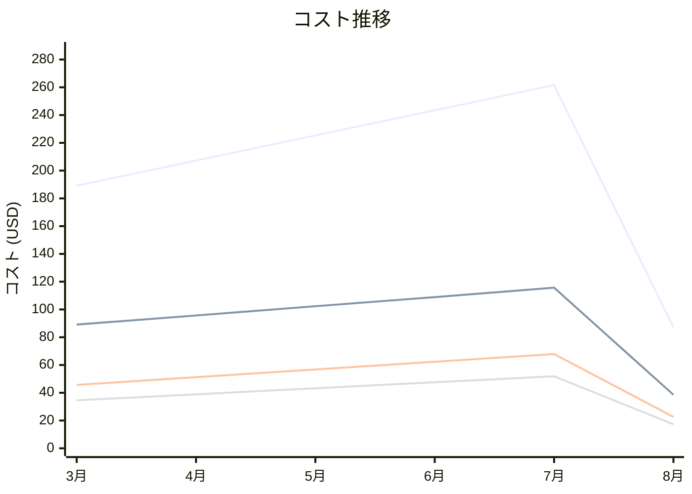

# AWS WAF コスト分析レポート

**分析日**: 2025/08/14

## 概要

AWS WAFの2025年3月から8月までの6ヶ月間のコスト分析結果です。

## 料金の特徴

### 分析サマリー
- コスト削減トレンド（10%以上の削減）
- 変動性が高い

### 費用項目詳細

| 費用項目 | 説明 | 6ヶ月平均 | 成長率 | 変動幅 |
|---------|------|----------|--------|--------|
| All | 全体費用 | $202.31 | -53.9% | $174.37 |
| Web ACL | WAF Web ACL月額料金 | $91.71 | -56.7% | $77.11 |
| Rule Groups | WAFルールグループ料金 | $51.09 | -50.4% | $45.26 |
| Request Processing | WAFリクエスト処理料金 | $38.91 | -49.9% | $34.59 |
| Managed Rules | WAFマネージドルール料金 | $21.26 | -56.0% | $17.85 |

## コスト最適化提案

### 主要な推奨事項

### 月次コスト詳細

| 費用項目 | 2025年3月 | 2025年4月 | 2025年5月 | 2025年6月 | 2025年7月 | 2025年8月 |
|---------|---------|---------|---------|---------|---------|---------|
| All | $189.12 | $207.23 | $225.34 | $243.45 | $261.56 | $87.19 |
| Web ACL | $89.12 | $95.67 | $102.34 | $108.90 | $115.67 | $38.56 |
| Rule Groups | $45.67 | $51.23 | $56.78 | $62.34 | $67.89 | $22.63 |
| Request Processing | $34.56 | $38.90 | $43.23 | $47.56 | $51.89 | $17.30 |
| Managed Rules | $19.77 | $21.43 | $25.00 | $26.55 | $26.11 | $8.70 |

### コスト推移グラフ

**凡例:**
- ● **All** (平均: $202.31)
- ● **Web ACL** (平均: $91.71)
- ● **Rule Groups** (平均: $51.09)
- ● **Request Processing** (平均: $38.91)

---
*このレポートは自動生成されました。最新の分析結果については定期的に更新してください。*
