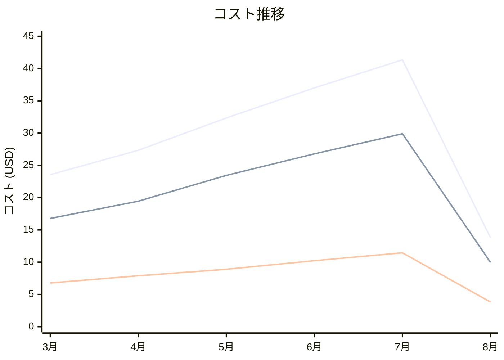

# Amazon DynamoDB コスト分析レポート

**分析日**: 2025/08/14

## 概要

Amazon DynamoDBの2025年3月から8月までの6ヶ月間のコスト分析結果です。

## 料金の特徴

### 分析サマリー
- コスト削減トレンド（10%以上の削減）
- 変動性が高い

### 費用項目詳細

| 費用項目 | 説明 | 6ヶ月平均 | 成長率 | 変動幅 |
|---------|------|----------|--------|--------|
| All | 全体費用 | $29.23 | -41.5% | $27.56 |
| On-Demand Read/Write Requests | 読み書きリクエスト従量課金 | $21.05 | -40.6% | $19.93 |
| Storage | NoSQLデータベースストレージ料金 | $8.18 | -43.7% | $7.63 |

## コスト最適化提案

### 主要な推奨事項

### 月次コスト詳細

| 費用項目 | 2025年3月 | 2025年4月 | 2025年5月 | 2025年6月 | 2025年7月 | 2025年8月 |
|---------|---------|---------|---------|---------|---------|---------|
| All | $23.56 | $27.34 | $32.35 | $37.01 | $41.35 | $13.79 |
| On-Demand Read/Write Requests | $16.78 | $19.45 | $23.45 | $26.78 | $29.90 | $9.97 |
| Storage | $6.78 | $7.89 | $8.90 | $10.23 | $11.45 | $3.82 |

### コスト推移グラフ

**凡例:**
- ● **All** (平均: $29.23)
- ● **On-Demand Read/Write Requests** (平均: $21.05)
- ● **Storage** (平均: $8.18)

---
*このレポートは自動生成されました。最新の分析結果については定期的に更新してください。*
