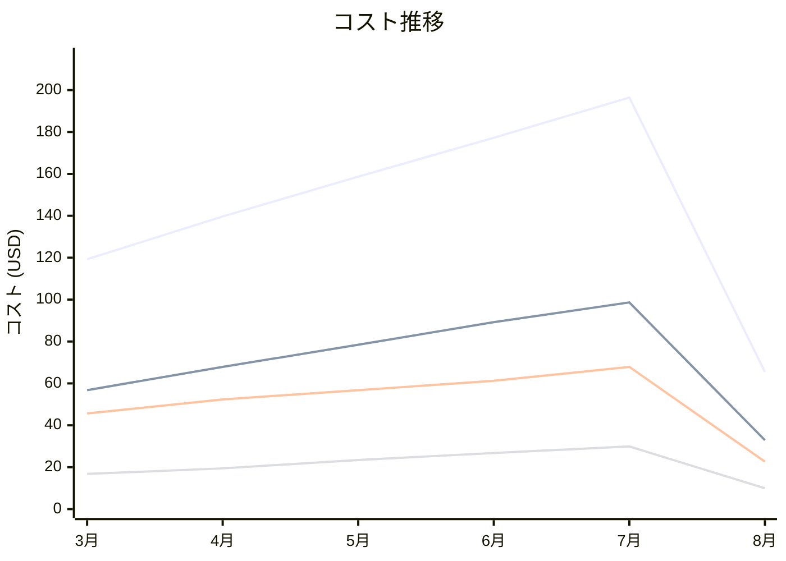

# Amazon EBS コスト分析レポート

**分析日**: 2025/08/14

## 概要

Amazon EBSの2025年3月から8月までの6ヶ月間のコスト分析結果です。

## 料金の特徴

### 分析サマリー
- コスト削減トレンド（10%以上の削減）
- 変動性が高い

### 費用項目詳細

| 費用項目 | 説明 | 6ヶ月平均 | 成長率 | 変動幅 |
|---------|------|----------|--------|--------|
| All | 全体費用 | $142.80 | -45.1% | $130.97 |
| General Purpose SSD (gp3) | 汎用SSDボリュームの月額料金 | $70.65 | -42.1% | $65.78 |
| Provisioned IOPS SSD (io2) | 高性能IOPSボリュームの月額料金 | $51.09 | -50.4% | $45.26 |
| Snapshots | ボリュームスナップショットの保存料金 | $21.05 | -40.6% | $19.93 |

## コスト最適化提案

### 主要な推奨事項

### 月次コスト詳細

| 費用項目 | 2025年3月 | 2025年4月 | 2025年5月 | 2025年6月 | 2025年7月 | 2025年8月 |
|---------|---------|---------|---------|---------|---------|---------|
| All | $119.23 | $139.68 | $158.68 | $177.24 | $196.46 | $65.49 |
| General Purpose SSD (gp3) | $56.78 | $67.89 | $78.45 | $89.23 | $98.67 | $32.89 |
| Provisioned IOPS SSD (io2) | $45.67 | $52.34 | $56.78 | $61.23 | $67.89 | $22.63 |
| Snapshots | $16.78 | $19.45 | $23.45 | $26.78 | $29.90 | $9.97 |

### コスト推移グラフ

**凡例:**
- ● **All** (平均: $142.80)
- ● **General Purpose SSD (gp3)** (平均: $70.65)
- ● **Provisioned IOPS SSD (io2)** (平均: $51.09)
- ● **Snapshots** (平均: $21.05)

---
*このレポートは自動生成されました。最新の分析結果については定期的に更新してください。*
