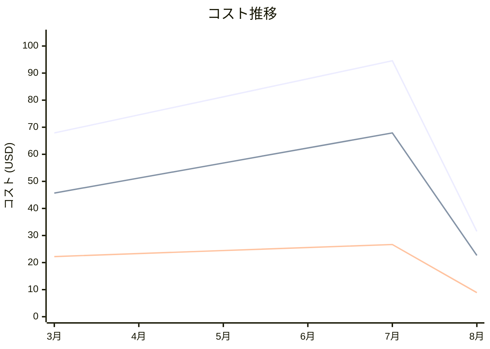

# Amazon Elastic Container Registry コスト分析レポート

**分析日**: 2025/08/14

## 概要

Amazon Elastic Container Registryの2025年3月から8月までの6ヶ月間のコスト分析結果です。

## 料金の特徴

### 分析サマリー
- コスト削減トレンド（10%以上の削減）
- 変動性が高い

### 費用項目詳細

| 費用項目 | 説明 | 6ヶ月平均 | 成長率 | 変動幅 |
|---------|------|----------|--------|--------|
| All | 全体費用 | $72.94 | -53.6% | $63.04 |
| Storage | ECRコンテナイメージストレージ料金 | $51.09 | -50.4% | $45.26 |
| Data Transfer | ECRデータ転送料金 | $21.85 | -60.0% | $17.78 |

## コスト最適化提案

### 主要な推奨事項

### 月次コスト詳細

| 費用項目 | 2025年3月 | 2025年4月 | 2025年5月 | 2025年6月 | 2025年7月 | 2025年8月 |
|---------|---------|---------|---------|---------|---------|---------|
| All | $67.89 | $74.56 | $81.23 | $87.90 | $94.56 | $31.52 |
| Storage | $45.67 | $51.23 | $56.78 | $62.34 | $67.89 | $22.63 |
| Data Transfer | $22.22 | $23.33 | $24.45 | $25.56 | $26.67 | $8.89 |

### コスト推移グラフ

**凡例:**
- ● **All** (平均: $72.94)
- ● **Storage** (平均: $51.09)
- ● **Data Transfer** (平均: $21.85)

---
*このレポートは自動生成されました。最新の分析結果については定期的に更新してください。*
