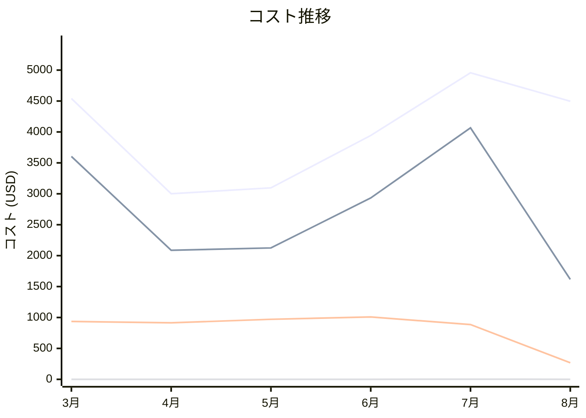

# Amazon Elastic Container Service コスト分析レポート

**分析日**: 2025/08/14

## 概要

Amazon Elastic Container Serviceの2025年3月から8月までの6ヶ月間のコスト分析結果です。

## 料金の特徴

### 分析サマリー
- 安定したコスト推移
- 変動性が低い

### 費用項目詳細

| 費用項目 | 説明 | 6ヶ月平均 | 成長率 | 変動幅 |
|---------|------|----------|--------|--------|
| All | 全体費用 | $4005.66 | -1.0% | $1955.71 |
| Fargate vCPU | Fargate vCPU時間料金 | $2738.50 | -55.1% | $2449.59 |
| Fargate Memory | Fargateメモリ使用料金 | $0.51 | +125.0% | $1.72 |
| EC2 Launch Type | EC2起動タイプサービス料金 | $0.00 | +0.0% | $0.00 |
| Data Transfer | データ転送料金 | $830.29 | -71.4% | $740.77 |

## コスト最適化提案

### 主要な推奨事項

### 月次コスト詳細

| 費用項目 | 2025年3月 | 2025年4月 | 2025年5月 | 2025年6月 | 2025年7月 | 2025年8月 |
|---------|---------|---------|---------|---------|---------|---------|
| All | $4540.92 | $3000.95 | $3096.29 | $3942.83 | $4956.66 | $4496.31 |
| Fargate vCPU | $3604.21 | $2086.33 | $2124.72 | $2932.95 | $4066.20 | $1616.61 |
| Fargate Memory | $0.20 | $0.17 | $0.17 | $0.20 | $1.89 | $0.45 |
| EC2 Launch Type | $0.00 | $0.00 | $0.00 | $0.00 | $0.00 | $0.00 |
| Data Transfer | $935.57 | $913.61 | $970.56 | $1008.70 | $885.35 | $267.93 |

### コスト推移グラフ

**凡例:**
- ● **All** (平均: $4005.66)
- ● **Fargate vCPU** (平均: $2738.50)
- ● **Data Transfer** (平均: $830.29)
- ● **Fargate Memory** (平均: $0.51)

---
*このレポートは自動生成されました。最新の分析結果については定期的に更新してください。*
