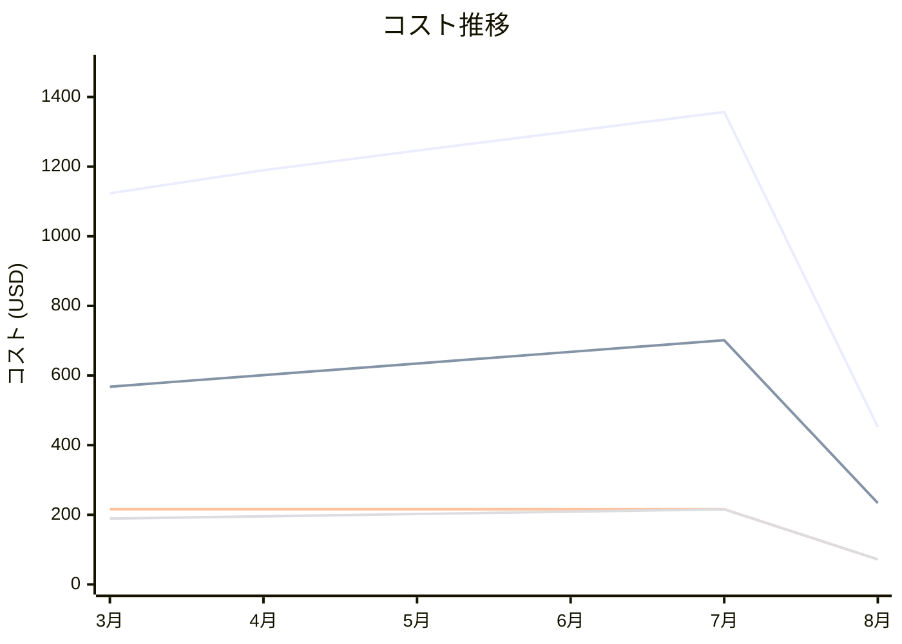

# Amazon Elastic Container Service for Kubernetes コスト分析レポート

**分析日**: 2025/08/14

## 概要

Amazon Elastic Container Service for Kubernetesの2025年3月から8月までの6ヶ月間のコスト分析結果です。

## 料金の特徴

### 分析サマリー
- コスト削減トレンド（10%以上の削減）
- 変動性が高い

### 費用項目詳細

| 費用項目 | 説明 | 6ヶ月平均 | 成長率 | 変動幅 |
|---------|------|----------|--------|--------|
| All | 全体費用 | $1111.55 | -59.7% | $904.52 |
| Control Plane | EKSコントロールプレーン料金 | $192.00 | -66.7% | $144.00 |
| Worker Nodes | EKSワーカーノード料金 | $567.76 | -58.8% | $467.49 |
| Load Balancer | EKSロードバランサー料金 | $180.60 | -62.0% | $143.78 |
| Add-ons | EKSアドオン料金 | $91.71 | -56.7% | $77.11 |
| Fargate | EKS Fargate料金 | $79.48 | -41.2% | $72.14 |

## コスト最適化提案

### 主要な推奨事項

### 月次コスト詳細

| 費用項目 | 2025年3月 | 2025年4月 | 2025年5月 | 2025年6月 | 2025年7月 | 2025年8月 |
|---------|---------|---------|---------|---------|---------|---------|
| All | $1123.45 | $1189.67 | $1245.89 | $1301.23 | $1356.78 | $452.26 |
| Control Plane | $216.00 | $216.00 | $216.00 | $216.00 | $216.00 | $72.00 |
| Worker Nodes | $567.89 | $601.23 | $634.56 | $667.89 | $701.23 | $233.74 |
| Load Balancer | $189.12 | $195.67 | $202.34 | $208.90 | $215.67 | $71.89 |
| Add-ons | $89.12 | $95.67 | $102.34 | $108.90 | $115.67 | $38.56 |
| Fargate | $61.32 | $81.10 | $90.65 | $99.54 | $108.21 | $36.07 |

### コスト推移グラフ

**凡例:**
- ● **All** (平均: $1111.55)
- ● **Worker Nodes** (平均: $567.76)
- ● **Control Plane** (平均: $192.00)
- ● **Load Balancer** (平均: $180.60)

---
*このレポートは自動生成されました。最新の分析結果については定期的に更新してください。*
