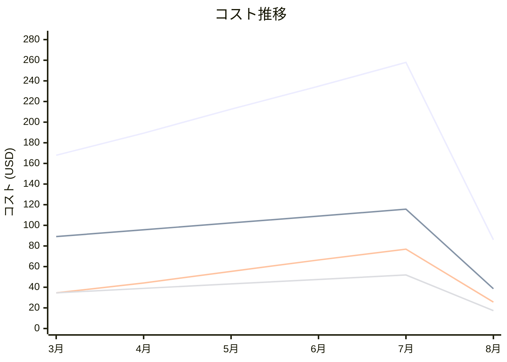

# Amazon Elastic File System コスト分析レポート

**分析日**: 2025/08/14

## 概要

Amazon Elastic File Systemの2025年3月から8月までの6ヶ月間のコスト分析結果です。

## 料金の特徴

### 分析サマリー
- コスト削減トレンド（10%以上の削減）
- 変動性が高い

### 費用項目詳細

| 費用項目 | 説明 | 6ヶ月平均 | 成長率 | 変動幅 |
|---------|------|----------|--------|--------|
| All | 全体費用 | $191.41 | -48.8% | $171.93 |
| Standard Storage | EFS標準ストレージ料金 | $91.71 | -56.7% | $77.11 |
| Infrequent Access Storage | EFS低頻度アクセスストレージ料金 | $38.91 | -49.9% | $34.59 |
| Provisioned Throughput | EFSプロビジョニング済みスループット料金 | $50.50 | -25.8% | $51.26 |
| Regional Data Transfer | EFSリージョナルデータ転送料金 | $10.29 | -53.6% | $8.97 |

## コスト最適化提案

### 主要な推奨事項

### 月次コスト詳細

| 費用項目 | 2025年3月 | 2025年4月 | 2025年5月 | 2025年6月 | 2025年7月 | 2025年8月 |
|---------|---------|---------|---------|---------|---------|---------|
| All | $167.89 | $189.34 | $212.56 | $234.78 | $257.90 | $85.97 |
| Standard Storage | $89.12 | $95.67 | $102.34 | $108.90 | $115.67 | $38.56 |
| Infrequent Access Storage | $34.56 | $38.90 | $43.23 | $47.56 | $51.89 | $17.30 |
| Provisioned Throughput | $34.56 | $44.12 | $55.34 | $66.45 | $76.89 | $25.63 |
| Regional Data Transfer | $9.65 | $10.65 | $11.65 | $11.87 | $13.45 | $4.48 |

### コスト推移グラフ

**凡例:**
- ● **All** (平均: $191.41)
- ● **Standard Storage** (平均: $91.71)
- ● **Provisioned Throughput** (平均: $50.50)
- ● **Infrequent Access Storage** (平均: $38.91)

---
*このレポートは自動生成されました。最新の分析結果については定期的に更新してください。*
