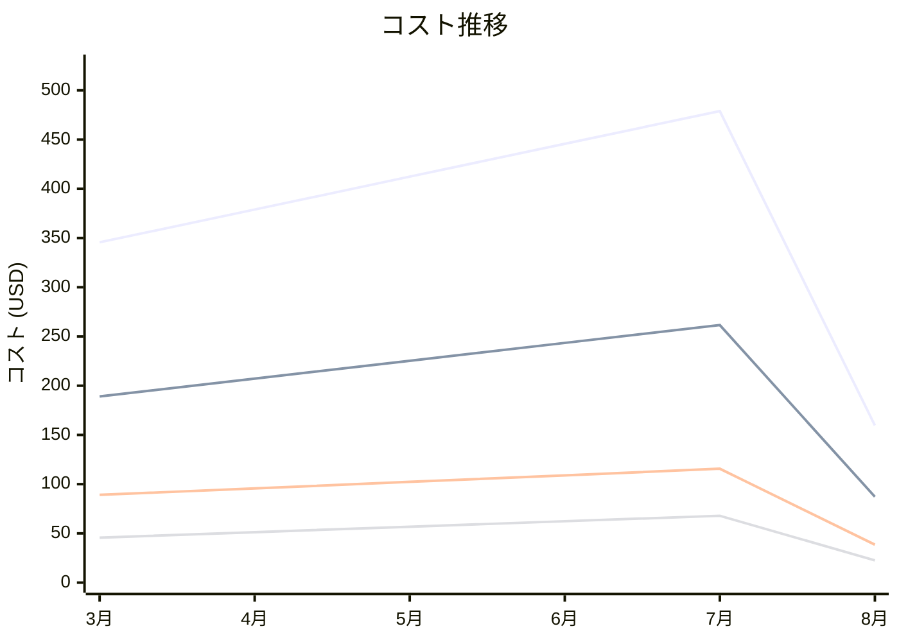

# Elastic Load Balancing コスト分析レポート

**分析日**: 2025/08/14

## 概要

Elastic Load Balancingの2025年3月から8月までの6ヶ月間のコスト分析結果です。

## 料金の特徴

### 分析サマリー
- コスト削減トレンド（10%以上の削減）
- 変動性が高い

### 費用項目詳細

| 費用項目 | 説明 | 6ヶ月平均 | 成長率 | 変動幅 |
|---------|------|----------|--------|--------|
| All | 全体費用 | $370.19 | -53.8% | $319.27 |
| Application Load Balancer | ALB基本料金 | $202.31 | -53.9% | $174.37 |
| Network Load Balancer | NLB基本料金 | $91.71 | -56.7% | $77.11 |
| Classic Load Balancer | CLB基本料金 | $51.09 | -50.4% | $45.26 |
| Data Processing | ロードバランサーデータ処理料金 | $25.07 | -48.3% | $22.53 |

## コスト最適化提案

### 主要な推奨事項

### 月次コスト詳細

| 費用項目 | 2025年3月 | 2025年4月 | 2025年5月 | 2025年6月 | 2025年7月 | 2025年8月 |
|---------|---------|---------|---------|---------|---------|---------|
| All | $345.67 | $378.90 | $412.34 | $445.67 | $478.90 | $159.63 |
| Application Load Balancer | $189.12 | $207.23 | $225.34 | $243.45 | $261.56 | $87.19 |
| Network Load Balancer | $89.12 | $95.67 | $102.34 | $108.90 | $115.67 | $38.56 |
| Classic Load Balancer | $45.67 | $51.23 | $56.78 | $62.34 | $67.89 | $22.63 |
| Data Processing | $21.76 | $24.77 | $27.88 | $30.98 | $33.78 | $11.25 |

### コスト推移グラフ

**凡例:**
- ● **All** (平均: $370.19)
- ● **Application Load Balancer** (平均: $202.31)
- ● **Network Load Balancer** (平均: $91.71)
- ● **Classic Load Balancer** (平均: $51.09)

---
*このレポートは自動生成されました。最新の分析結果については定期的に更新してください。*
