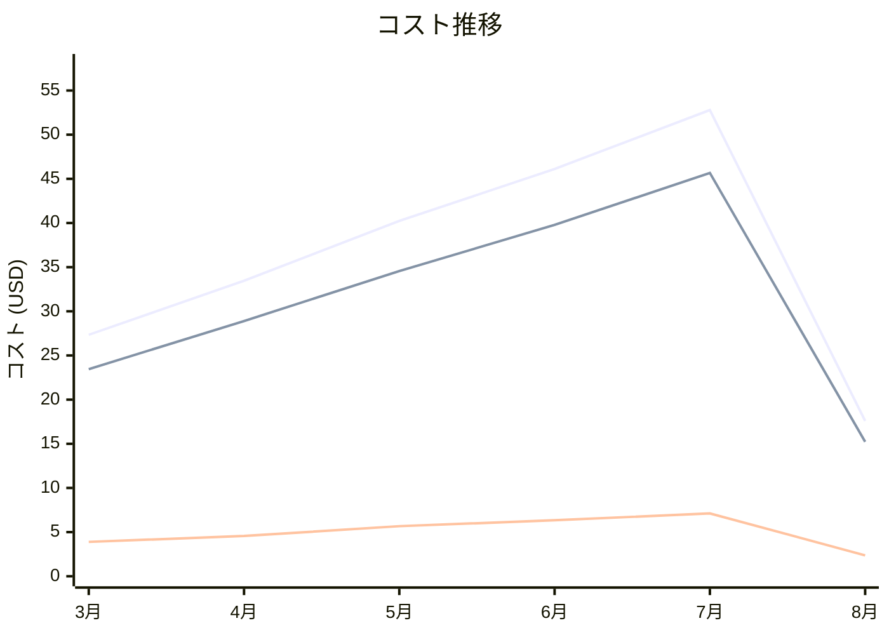

# Amazon ElastiCache コスト分析レポート

**分析日**: 2025/08/14

## 概要

Amazon ElastiCacheの2025年3月から8月までの6ヶ月間のコスト分析結果です。

## 料金の特徴

### 分析サマリー
- コスト削減トレンド（10%以上の削減）
- 変動性が高い

### 費用項目詳細

| 費用項目 | 説明 | 6ヶ月平均 | 成長率 | 変動幅 |
|---------|------|----------|--------|--------|
| All | 全体費用 | $36.26 | -35.7% | $35.20 |
| Cache Node Hours (cache.t3.micro) | 超小型キャッシュノードの時間課金 | $31.26 | -35.1% | $30.45 |
| Data Transfer | キャッシュからのデータ転送料金 | $4.99 | -39.1% | $4.75 |

## コスト最適化提案

### 主要な推奨事項

### 月次コスト詳細

| 費用項目 | 2025年3月 | 2025年4月 | 2025年5月 | 2025年6月 | 2025年7月 | 2025年8月 |
|---------|---------|---------|---------|---------|---------|---------|
| All | $27.34 | $33.46 | $40.23 | $46.12 | $52.79 | $17.59 |
| Cache Node Hours (cache.t3.micro) | $23.45 | $28.90 | $34.56 | $39.78 | $45.67 | $15.22 |
| Data Transfer | $3.89 | $4.56 | $5.67 | $6.34 | $7.12 | $2.37 |

### コスト推移グラフ

**凡例:**
- ● **All** (平均: $36.26)
- ● **Cache Node Hours (cache.t3.micro)** (平均: $31.26)
- ● **Data Transfer** (平均: $4.99)

---
*このレポートは自動生成されました。最新の分析結果については定期的に更新してください。*
