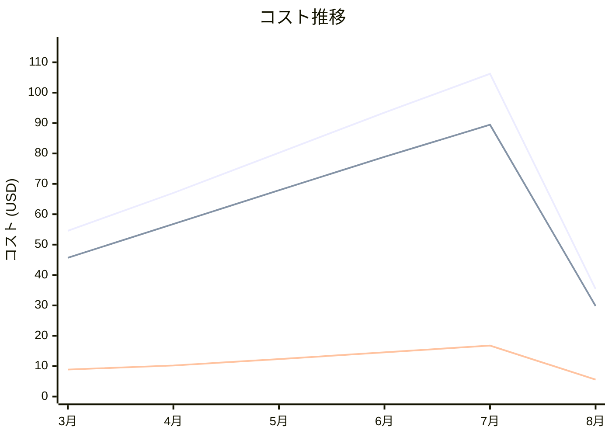

# Amazon Elasticsearch コスト分析レポート

**分析日**: 2025/08/14

## 概要

Amazon Elasticsearchの2025年3月から8月までの6ヶ月間のコスト分析結果です。

## 料金の特徴

### 分析サマリー
- コスト削減トレンド（10%以上の削減）
- 変動性が高い

### 費用項目詳細

| 費用項目 | 説明 | 6ヶ月平均 | 成長率 | 変動幅 |
|---------|------|----------|--------|--------|
| All | 全体費用 | $72.82 | -35.1% | $70.82 |
| Instance Hours (t3.small.elasticsearch) | 小型検索インスタンスの時間課金 | $61.42 | -34.7% | $59.63 |
| Storage | 検索インデックスストレージ料金 | $11.40 | -37.2% | $11.19 |

## コスト最適化提案

### 主要な推奨事項

### 月次コスト詳細

| 費用項目 | 2025年3月 | 2025年4月 | 2025年5月 | 2025年6月 | 2025年7月 | 2025年8月 |
|---------|---------|---------|---------|---------|---------|---------|
| All | $54.57 | $67.01 | $80.23 | $93.46 | $106.23 | $35.41 |
| Instance Hours (t3.small.elasticsearch) | $45.67 | $56.78 | $67.89 | $78.90 | $89.45 | $29.82 |
| Storage | $8.90 | $10.23 | $12.34 | $14.56 | $16.78 | $5.59 |

### コスト推移グラフ

**凡例:**
- ● **All** (平均: $72.82)
- ● **Instance Hours (t3.small.elasticsearch)** (平均: $61.42)
- ● **Storage** (平均: $11.40)

---
*このレポートは自動生成されました。最新の分析結果については定期的に更新してください。*
