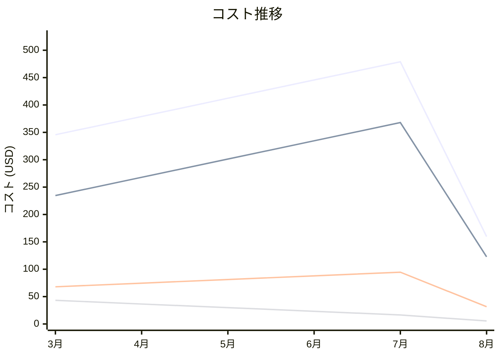

# F5 Rules for WAF - Common Vulnerabilities & Exposures (CVE) Rules コスト分析レポート

**分析日**: 2025/08/14

## 概要

F5 Rules for WAF - Common Vulnerabilities & Exposures (CVE) Rulesの2025年3月から8月までの6ヶ月間のコスト分析結果です。

## 料金の特徴

### 分析サマリー
- コスト削減トレンド（10%以上の削減）
- 変動性が高い

### 費用項目詳細

| 費用項目 | 説明 | 6ヶ月平均 | 成長率 | 変動幅 |
|---------|------|----------|--------|--------|
| All | 全体費用 | $370.19 | -53.8% | $319.27 |
| Rule Usage | F5 CVEルール使用料金 | $271.46 | -47.7% | $245.26 |
| Updates | F5 CVEルールアップデート料金 | $72.94 | -53.6% | $63.04 |
| Support | F5 CVEルールサポート料金 | $25.78 | -87.3% | $37.74 |

## コスト最適化提案

### 主要な推奨事項

### 月次コスト詳細

| 費用項目 | 2025年3月 | 2025年4月 | 2025年5月 | 2025年6月 | 2025年7月 | 2025年8月 |
|---------|---------|---------|---------|---------|---------|---------|
| All | $345.67 | $378.90 | $412.34 | $445.67 | $478.90 | $159.63 |
| Rule Usage | $234.56 | $267.89 | $301.23 | $334.56 | $367.89 | $122.63 |
| Updates | $67.89 | $74.56 | $81.23 | $87.90 | $94.56 | $31.52 |
| Support | $43.22 | $36.45 | $29.88 | $23.21 | $16.45 | $5.48 |

### コスト推移グラフ

**凡例:**
- ● **All** (平均: $370.19)
- ● **Rule Usage** (平均: $271.46)
- ● **Updates** (平均: $72.94)
- ● **Support** (平均: $25.78)

---
*このレポートは自動生成されました。最新の分析結果については定期的に更新してください。*
