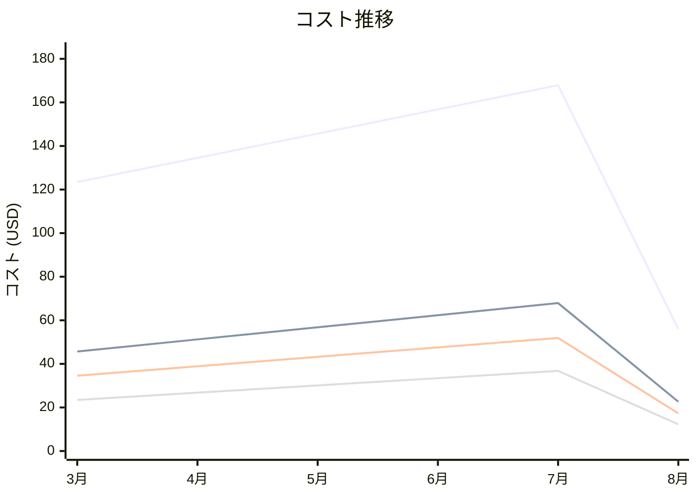

# Amazon GuardDuty コスト分析レポート

**分析日**: 2025/08/14

## 概要

Amazon GuardDutyの2025年3月から8月までの6ヶ月間のコスト分析結果です。

## 料金の特徴

### 分析サマリー
- コスト削減トレンド（10%以上の削減）
- 変動性が高い

### 費用項目詳細

| 費用項目 | 説明 | 6ヶ月平均 | 成長率 | 変動幅 |
|---------|------|----------|--------|--------|
| All | 全体費用 | $130.72 | -54.7% | $111.93 |
| CloudTrail Events | GuardDuty CloudTrailイベント分析料金 | $51.09 | -50.4% | $45.26 |
| DNS Logs | GuardDuty DNSログ分析料金 | $38.91 | -49.9% | $34.59 |
| VPC Flow Logs | GuardDuty VPCフローログ分析料金 | $27.14 | -47.7% | $24.52 |
| S3 Data Events | GuardDuty S3データイベント分析料金 | $13.91 | -80.9% | $16.00 |

## コスト最適化提案

### 主要な推奨事項

### 月次コスト詳細

| 費用項目 | 2025年3月 | 2025年4月 | 2025年5月 | 2025年6月 | 2025年7月 | 2025年8月 |
|---------|---------|---------|---------|---------|---------|---------|
| All | $123.45 | $134.56 | $145.67 | $156.78 | $167.89 | $55.96 |
| CloudTrail Events | $45.67 | $51.23 | $56.78 | $62.34 | $67.89 | $22.63 |
| DNS Logs | $34.56 | $38.90 | $43.23 | $47.56 | $51.89 | $17.30 |
| VPC Flow Logs | $23.45 | $26.78 | $30.12 | $33.45 | $36.78 | $12.26 |
| S3 Data Events | $19.77 | $15.65 | $15.54 | $17.43 | $11.33 | $3.77 |

### コスト推移グラフ

**凡例:**
- ● **All** (平均: $130.72)
- ● **CloudTrail Events** (平均: $51.09)
- ● **DNS Logs** (平均: $38.91)
- ● **VPC Flow Logs** (平均: $27.14)

---
*このレポートは自動生成されました。最新の分析結果については定期的に更新してください。*
