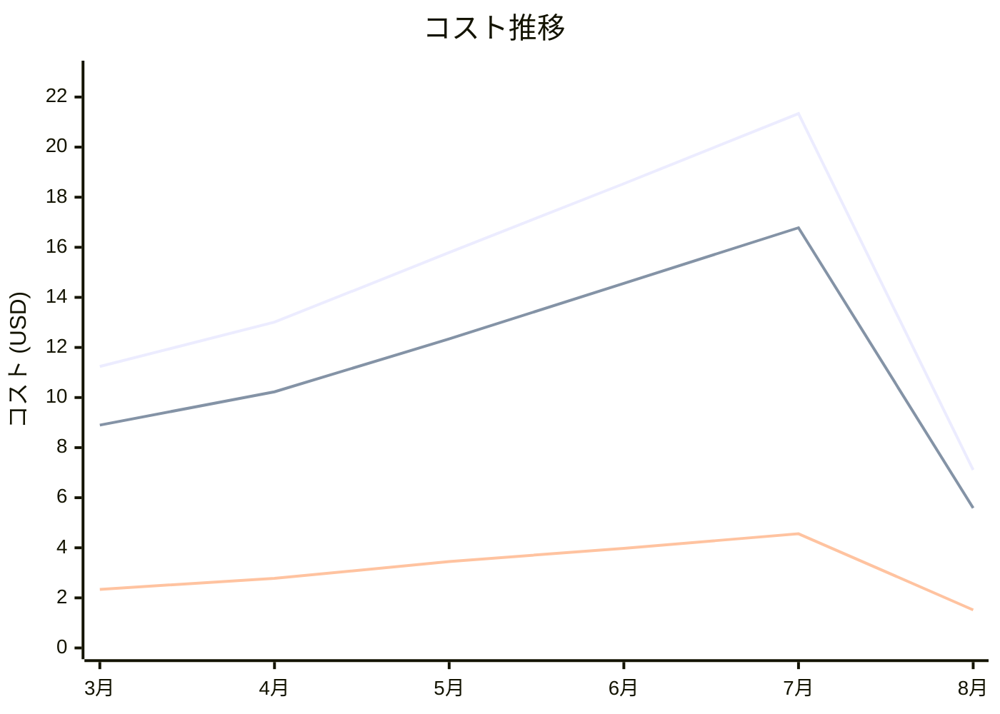

# Amazon Kinesis コスト分析レポート

**分析日**: 2025/08/14

## 概要

Amazon Kinesisの2025年3月から8月までの6ヶ月間のコスト分析結果です。

## 料金の特徴

### 分析サマリー
- コスト削減トレンド（10%以上の削減）
- 変動性が高い

### 費用項目詳細

| 費用項目 | 説明 | 6ヶ月平均 | 成長率 | 変動幅 |
|---------|------|----------|--------|--------|
| All | 全体費用 | $14.51 | -36.7% | $14.23 |
| Shard Hours | データストリーミングシャード時間料金 | $11.40 | -37.2% | $11.19 |
| PUT Payload Units | データ投入ペイロード料金 | $3.10 | -35.0% | $3.04 |

## コスト最適化提案

### 主要な推奨事項

### 月次コスト詳細

| 費用項目 | 2025年3月 | 2025年4月 | 2025年5月 | 2025年6月 | 2025年7月 | 2025年8月 |
|---------|---------|---------|---------|---------|---------|---------|
| All | $11.24 | $13.01 | $15.79 | $18.54 | $21.34 | $7.11 |
| Shard Hours | $8.90 | $10.23 | $12.34 | $14.56 | $16.78 | $5.59 |
| PUT Payload Units | $2.34 | $2.78 | $3.45 | $3.98 | $4.56 | $1.52 |

### コスト推移グラフ

**凡例:**
- ● **All** (平均: $14.51)
- ● **Shard Hours** (平均: $11.40)
- ● **PUT Payload Units** (平均: $3.10)

---
*このレポートは自動生成されました。最新の分析結果については定期的に更新してください。*
