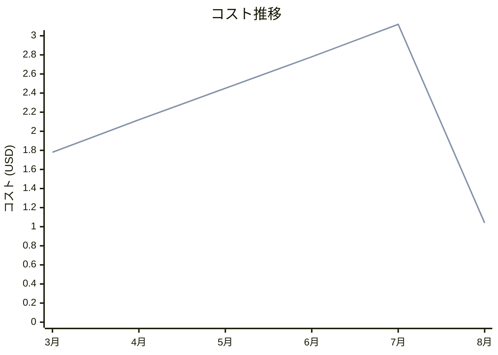

# Amazon KMS コスト分析レポート

**分析日**: 2025/08/14

## 概要

Amazon KMSの2025年3月から8月までの6ヶ月間のコスト分析結果です。

## 料金の特徴

### 分析サマリー
- コスト削減トレンド（10%以上の削減）
- 変動性が高い

### 費用項目詳細

| 費用項目 | 説明 | 6ヶ月平均 | 成長率 | 変動幅 |
|---------|------|----------|--------|--------|
| All | 全体費用 | $2.22 | -41.6% | $2.08 |
| Key Usage | 暗号化キー使用料金 | $2.22 | -41.6% | $2.08 |

## コスト最適化提案

### 主要な推奨事項

### 月次コスト詳細

| 費用項目 | 2025年3月 | 2025年4月 | 2025年5月 | 2025年6月 | 2025年7月 | 2025年8月 |
|---------|---------|---------|---------|---------|---------|---------|
| All | $1.78 | $2.12 | $2.45 | $2.78 | $3.12 | $1.04 |
| Key Usage | $1.78 | $2.12 | $2.45 | $2.78 | $3.12 | $1.04 |

### コスト推移グラフ

**凡例:**
- ● **All** (平均: $2.22)
- ● **Key Usage** (平均: $2.22)

---
*このレポートは自動生成されました。最新の分析結果については定期的に更新してください。*
