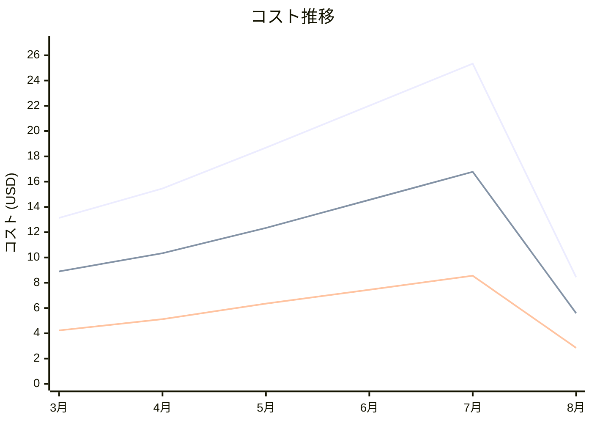

# Amazon Lambda コスト分析レポート

**分析日**: 2025/08/14

## 概要

Amazon Lambdaの2025年3月から8月までの6ヶ月間のコスト分析結果です。

## 料金の特徴

### 分析サマリー
- コスト削減トレンド（10%以上の削減）
- 変動性が高い

### 費用項目詳細

| 費用項目 | 説明 | 6ヶ月平均 | 成長率 | 変動幅 |
|---------|------|----------|--------|--------|
| All | 全体費用 | $17.18 | -35.7% | $16.90 |
| Request Charges | 関数実行リクエスト数に基づく料金 | $11.42 | -37.2% | $11.19 |
| Duration Charges (GB-seconds) | 実行時間とメモリ使用量に基づく料金 | $5.76 | -32.6% | $5.71 |

## コスト最適化提案

### 主要な推奨事項
- メモリサイズと実行時間の最適化
- 不要な関数実行の削除
- プロビジョンド同時実行の見直し
- 関数の統合・集約検討

### 月次コスト詳細

| 費用項目 | 2025年3月 | 2025年4月 | 2025年5月 | 2025年6月 | 2025年7月 | 2025年8月 |
|---------|---------|---------|---------|---------|---------|---------|
| All | $13.13 | $15.46 | $18.69 | $22.01 | $25.34 | $8.44 |
| Request Charges | $8.90 | $10.34 | $12.34 | $14.56 | $16.78 | $5.59 |
| Duration Charges (GB-seconds) | $4.23 | $5.12 | $6.35 | $7.45 | $8.56 | $2.85 |

### コスト推移グラフ

**凡例:**
- ● **All** (平均: $17.18)
- ● **Request Charges** (平均: $11.42)
- ● **Duration Charges (GB-seconds)** (平均: $5.76)

---
*このレポートは自動生成されました。最新の分析結果については定期的に更新してください。*
