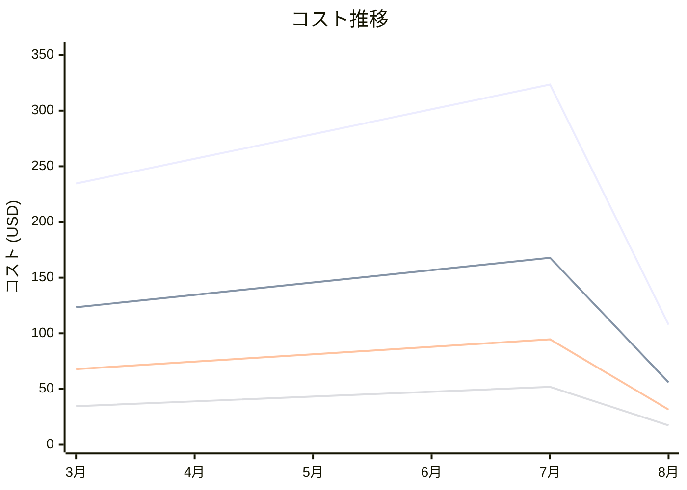

# Amazon Managed Service for Prometheus コスト分析レポート

**分析日**: 2025/08/14

## 概要

Amazon Managed Service for Prometheusの2025年3月から8月までの6ヶ月間のコスト分析結果です。

## 料金の特徴

### 分析サマリー
- コスト削減トレンド（10%以上の削減）
- 変動性が高い

### 費用項目詳細

| 費用項目 | 説明 | 6ヶ月平均 | 成長率 | 変動幅 |
|---------|------|----------|--------|--------|
| All | 全体費用 | $250.46 | -54.0% | $215.63 |
| Metric Ingestion | Prometheusメトリクス取り込み料金 | $130.72 | -54.7% | $111.93 |
| Metric Storage | Prometheusメトリクスストレージ料金 | $72.94 | -53.6% | $63.04 |
| Query Processing | Prometheusクエリ処理料金 | $38.91 | -49.9% | $34.59 |
| Alert Manager | Prometheusアラートマネージャー料金 | $7.89 | -64.9% | $6.07 |

## コスト最適化提案

### 主要な推奨事項

### 月次コスト詳細

| 費用項目 | 2025年3月 | 2025年4月 | 2025年5月 | 2025年6月 | 2025年7月 | 2025年8月 |
|---------|---------|---------|---------|---------|---------|---------|
| All | $234.56 | $256.78 | $278.90 | $301.23 | $323.45 | $107.82 |
| Metric Ingestion | $123.45 | $134.56 | $145.67 | $156.78 | $167.89 | $55.96 |
| Metric Storage | $67.89 | $74.56 | $81.23 | $87.90 | $94.56 | $31.52 |
| Query Processing | $34.56 | $38.90 | $43.23 | $47.56 | $51.89 | $17.30 |
| Alert Manager | $8.66 | $8.76 | $8.77 | $8.99 | $9.11 | $3.04 |

### コスト推移グラフ

**凡例:**
- ● **All** (平均: $250.46)
- ● **Metric Ingestion** (平均: $130.72)
- ● **Metric Storage** (平均: $72.94)
- ● **Query Processing** (平均: $38.91)

---
*このレポートは自動生成されました。最新の分析結果については定期的に更新してください。*
