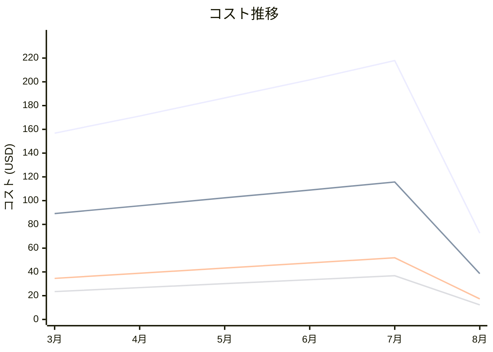

# Amazon MQ コスト分析レポート

**分析日**: 2025/08/14

## 概要

Amazon MQの2025年3月から8月までの6ヶ月間のコスト分析結果です。

## 料金の特徴

### 分析サマリー
- コスト削減トレンド（10%以上の削減）
- 変動性が高い

### 費用項目詳細

| 費用項目 | 説明 | 6ヶ月平均 | 成長率 | 変動幅 |
|---------|------|----------|--------|--------|
| All | 全体費用 | $167.78 | -53.7% | $145.26 |
| Broker Instance (mq.t3.micro) | MQ超小型ブローカーインスタンス料金 | $91.71 | -56.7% | $77.11 |
| Broker Storage | MQブローカーストレージ料金 | $38.91 | -49.9% | $34.59 |
| Data Transfer | MQデータ転送料金 | $27.14 | -47.7% | $24.52 |
| Network Load Balancer | MQネットワークロードバランサー料金 | $10.02 | -53.3% | $9.04 |

## コスト最適化提案

### 主要な推奨事項

### 月次コスト詳細

| 費用項目 | 2025年3月 | 2025年4月 | 2025年5月 | 2025年6月 | 2025年7月 | 2025年8月 |
|---------|---------|---------|---------|---------|---------|---------|
| All | $156.78 | $171.23 | $186.45 | $201.67 | $217.89 | $72.63 |
| Broker Instance (mq.t3.micro) | $89.12 | $95.67 | $102.34 | $108.90 | $115.67 | $38.56 |
| Broker Storage | $34.56 | $38.90 | $43.23 | $47.56 | $51.89 | $17.30 |
| Data Transfer | $23.45 | $26.78 | $30.12 | $33.45 | $36.78 | $12.26 |
| Network Load Balancer | $9.65 | $9.88 | $10.76 | $11.76 | $13.55 | $4.51 |

### コスト推移グラフ

**凡例:**
- ● **All** (平均: $167.78)
- ● **Broker Instance (mq.t3.micro)** (平均: $91.71)
- ● **Broker Storage** (平均: $38.91)
- ● **Data Transfer** (平均: $27.14)

---
*このレポートは自動生成されました。最新の分析結果については定期的に更新してください。*
