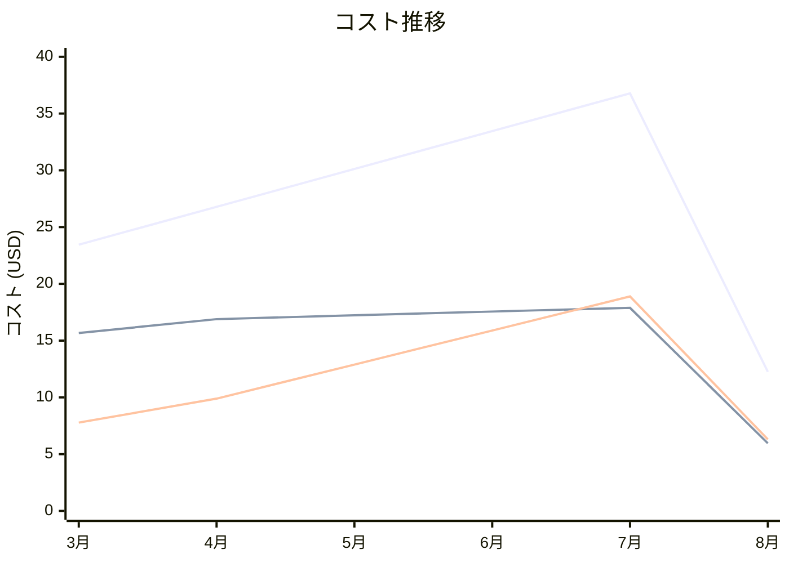

# Amazon Polly コスト分析レポート

**分析日**: 2025/08/14

## 概要

Amazon Pollyの2025年3月から8月までの6ヶ月間のコスト分析結果です。

## 料金の特徴

### 分析サマリー
- コスト削減トレンド（10%以上の削減）
- 変動性が高い

### 費用項目詳細

| 費用項目 | 説明 | 6ヶ月平均 | 成長率 | 変動幅 |
|---------|------|----------|--------|--------|
| All | 全体費用 | $27.14 | -47.7% | $24.52 |
| Standard Voices | Polly標準音声合成料金 | $15.20 | -62.0% | $11.93 |
| Neural Voices | Pollyニューラル音声合成料金 | $11.94 | -19.0% | $12.59 |

## コスト最適化提案

### 主要な推奨事項

### 月次コスト詳細

| 費用項目 | 2025年3月 | 2025年4月 | 2025年5月 | 2025年6月 | 2025年7月 | 2025年8月 |
|---------|---------|---------|---------|---------|---------|---------|
| All | $23.45 | $26.78 | $30.12 | $33.45 | $36.78 | $12.26 |
| Standard Voices | $15.67 | $16.89 | $17.23 | $17.56 | $17.89 | $5.96 |
| Neural Voices | $7.78 | $9.89 | $12.89 | $15.89 | $18.89 | $6.30 |

### コスト推移グラフ

**凡例:**
- ● **All** (平均: $27.14)
- ● **Standard Voices** (平均: $15.20)
- ● **Neural Voices** (平均: $11.94)

---
*このレポートは自動生成されました。最新の分析結果については定期的に更新してください。*
