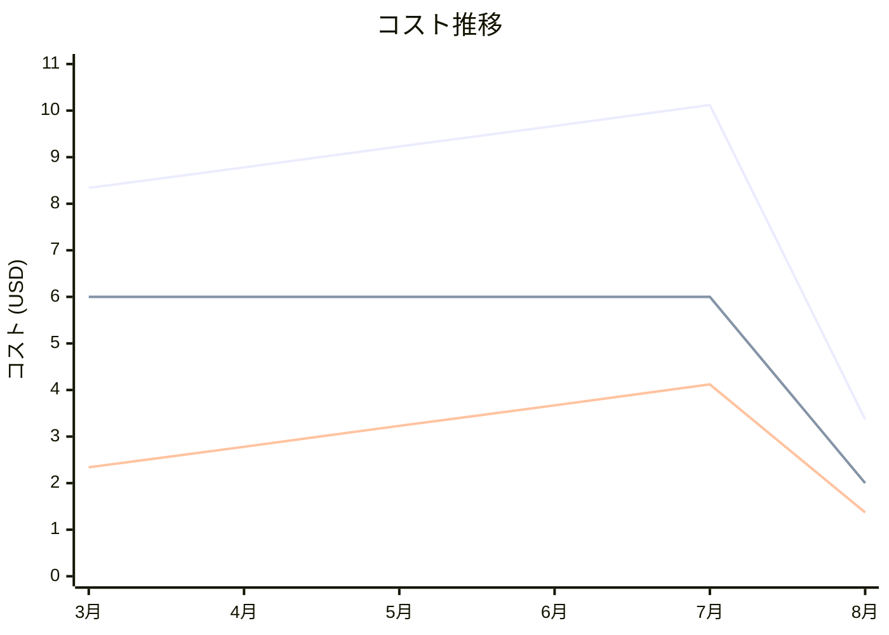

# Amazon Route 53 コスト分析レポート

**分析日**: 2025/08/14

## 概要

Amazon Route 53の2025年3月から8月までの6ヶ月間のコスト分析結果です。

## 料金の特徴

### 分析サマリー
- コスト削減トレンド（10%以上の削減）
- 変動性が高い

### 費用項目詳細

| 費用項目 | 説明 | 6ヶ月平均 | 成長率 | 変動幅 |
|---------|------|----------|--------|--------|
| All | 全体費用 | $8.25 | -59.6% | $6.75 |
| Hosted Zones | ホストゾーンの月額料金 | $5.33 | -66.7% | $4.00 |
| Standard Queries | DNSクエリ処理料金 | $2.92 | -41.5% | $2.75 |

## コスト最適化提案

### 主要な推奨事項

### 月次コスト詳細

| 費用項目 | 2025年3月 | 2025年4月 | 2025年5月 | 2025年6月 | 2025年7月 | 2025年8月 |
|---------|---------|---------|---------|---------|---------|---------|
| All | $8.34 | $8.78 | $9.23 | $9.67 | $10.12 | $3.37 |
| Hosted Zones | $6.00 | $6.00 | $6.00 | $6.00 | $6.00 | $2.00 |
| Standard Queries | $2.34 | $2.78 | $3.23 | $3.67 | $4.12 | $1.37 |

### コスト推移グラフ

**凡例:**
- ● **All** (平均: $8.25)
- ● **Hosted Zones** (平均: $5.33)
- ● **Standard Queries** (平均: $2.92)

---
*このレポートは自動生成されました。最新の分析結果については定期的に更新してください。*
