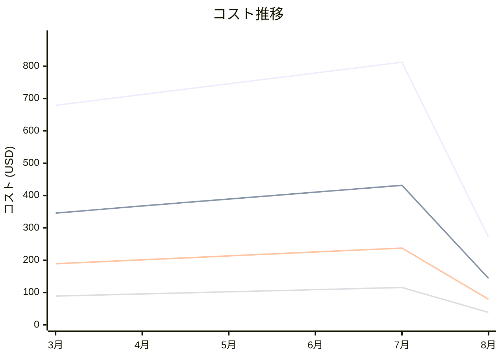

# Amazon SageMaker コスト分析レポート

**分析日**: 2025/08/14

## 概要

Amazon SageMakerの2025年3月から8月までの6ヶ月間のコスト分析結果です。

## 料金の特徴

### 分析サマリー
- コスト削減トレンド（10%以上の削減）
- 変動性が高い

### 費用項目詳細

| 費用項目 | 説明 | 6ヶ月平均 | 成長率 | 変動幅 |
|---------|------|----------|--------|--------|
| All | 全体費用 | $666.46 | -60.1% | $541.49 |
| Training Jobs | SageMakerトレーニングジョブ料金 | $348.07 | -58.4% | $287.71 |
| Inference Endpoints | SageMaker推論エンドポイント料金 | $190.98 | -58.1% | $158.37 |
| Notebook Instances | SageMakerノートブックインスタンス料金 | $91.71 | -56.7% | $77.11 |
| Processing Jobs | SageMaker処理ジョブ料金 | $35.70 | -83.4% | $45.85 |

## コスト最適化提案

### 主要な推奨事項

### 月次コスト詳細

| 費用項目 | 2025年3月 | 2025年4月 | 2025年5月 | 2025年6月 | 2025年7月 | 2025年8月 |
|---------|---------|---------|---------|---------|---------|---------|
| All | $678.90 | $712.34 | $745.67 | $778.90 | $812.23 | $270.74 |
| Training Jobs | $345.67 | $367.89 | $389.12 | $410.34 | $431.56 | $143.85 |
| Inference Endpoints | $189.12 | $201.23 | $213.34 | $225.45 | $237.56 | $79.19 |
| Notebook Instances | $89.12 | $95.67 | $102.34 | $108.90 | $115.67 | $38.56 |
| Processing Jobs | $54.99 | $47.55 | $40.87 | $34.21 | $27.44 | $9.14 |

### コスト推移グラフ

**凡例:**
- ● **All** (平均: $666.46)
- ● **Training Jobs** (平均: $348.07)
- ● **Inference Endpoints** (平均: $190.98)
- ● **Notebook Instances** (平均: $91.71)

---
*このレポートは自動生成されました。最新の分析結果については定期的に更新してください。*
